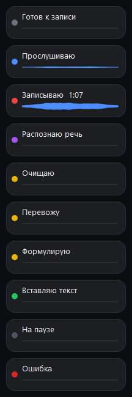
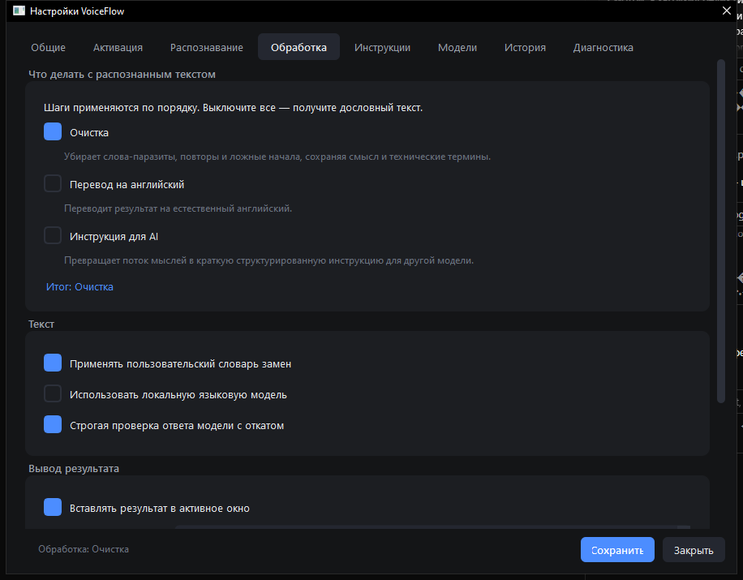
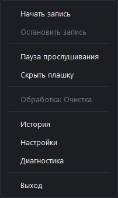
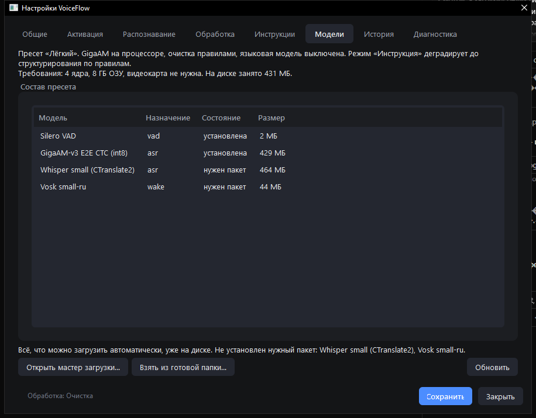
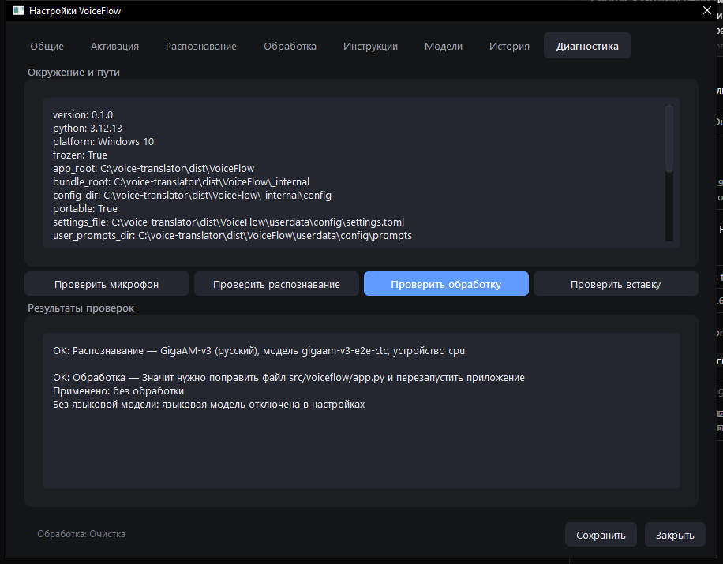
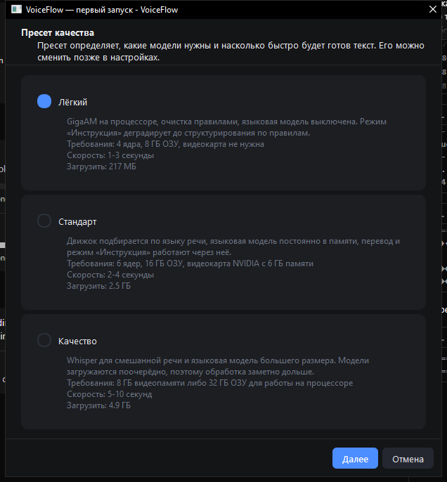
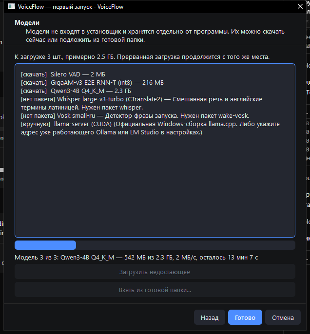

# VoiceFlow

<p align="center">
  
</p>

**Голосовой ввод для Windows, который работает без интернета.** Говорите
свободным потоком — приложение распознаёт речь, убирает слова-паразиты и
повторы, при желании переводит на английский или превращает сказанное в
готовую **английскую** инструкцию для AI-модели, а результат вставляет прямо
в то окно, где вы работали.

Аудио никуда не отправляется и на диск не пишется. После первой загрузки
моделей интернет не нужен вообще.

<p align="center">
  
</p>

---

## Зачем это нужно

Печатать медленнее, чем говорить, но диктовка обычно даёт мусор: «ну», «вот»,
«это самое», повторы и оборванные фразы. VoiceFlow убирает этот мусор и отдаёт
текст, который можно сразу отправлять — в чат, в письмо, в задачу или в промпт
для другой модели.

Три сценария, под которые всё сделано:

| Что говорите | Что получаете | Как включить | Что нужно |
| --- | --- | --- | --- |
| Поток мыслей по-русски | Чистый текст с пунктуацией | Шаг «Очистка» | Ничего лишнего |
| Мысль по-русски для англоязычного чата | Готовый английский текст | Шаг «Перевод на английский» | Языковая модель |
| Расплывчатое «хочу вот такое» | Английская инструкция для AI | Шаг «Инструкция для AI» | Языковая модель |

Шаги независимы и складываются в цепочку: можно включить только очистку, а
можно очистку и перевод сразу. Порядок меняется стрелками на вкладке
«Обработка».

**Важно:** «Перевод» и «Инструкция» без полностью скачанной языковой модели
не работают. Если модель ещё качается (файл `*.partial`) или сервер не
запущен, приложение вставит очищенный русский текст и покажет уведомление —
это не «режим сломался», а сигнал докачать модель на вкладке «Модели».

Закрытие окна настроек не завершает программу: VoiceFlow продолжает жить
в системном трее. Выход — только пункт «Выход» в меню иконки.

---

## Возможности

### Запуск записи

- **Горячая клавиша** — назначается нажатием: щёлкаете поле и жмёте нужное
  сочетание, ничего вводить руками не надо.
- **Боковая кнопка мыши** — назначается так же, нажатием по полю.
- **Голосовая команда** — своя фраза запуска и своя фраза остановки.
  Приложение постоянно слушает только её, распознавание речи при этом не
  работает и процессор не греет.
- **Меню в трее и щелчок по плашке.**

Останавливать запись можно повторным нажатием, удержанием клавиши, голосовой
командой или по тишине.

### Распознавание речи

- **GigaAM-v3** — русская модель, которая ставит знаки препинания и записывает
  числа цифрами. На процессоре работает в 6–8 раз быстрее реального времени.
- **Whisper** — для смешанной русско-английской речи: пишет `useEffect`,
  `Docker` и `GitHub` латиницей, а не кириллицей.
- Движок выбирается автоматически по языку либо задаётся вручную.

### Обработка текста



- **Очистка правилами** — слова-паразиты, повторы, мычание, ложные начала.
  Работает мгновенно и не требует языковой модели.
- **Очистка языковой моделью** — расставляет пунктуацию и разбивает поток на
  предложения и абзацы.
- **Перевод на английский** и **режим «Инструкция для AI»** — через локальную
  языковую модель; результат этих шагов всегда на английском. Если модель
  недоступна, вы получите уведомление вместо «тихого» русского текста.
- **Защита технических фрагментов**: пути к файлам, команды, названия функций
  и библиотек переносятся в ответ символ в символ.
- **Свой словарь замен** — если распознавание стабильно путает термин.
- **Проверка ответа модели**: если модель начала фантазировать или потеряла
  смысл, ответ отклоняется и вставляется очищенный текст. Лучше скромный
  результат, чем выдуманный.

### Вставка результата

- Текст попадает в буфер обмена и вставляется в то окно, которое было активным
  **на момент начала записи**, а не на момент окончания.
- Если вставить не удалось (окно от администратора, полноэкранная игра), текст
  остаётся в буфере, и приложение об этом сообщает.
- Прежнее содержимое буфера можно вернуть через десять секунд.

### Плашка состояния

Небольшое окно поверх остальных, которое не забирает фокус и не появляется на
панели задач. Показывает уровень микрофона и текущий этап: «Прослушиваю»,
«Записываю» с таймером, «Распознаю речь», «Перевожу», «Вставляю текст».
После вставки коротко подтверждает «Готово», а длинные сообщения об ошибках
показывает отдельным окном, а не обрезанной строкой.

Индикатор микрофона можно выбрать: волна, столбики или пульс.

### Оформление

Тёмная и светлая темы, свой акцентный цвет из готовых или из палитры,
отдельные цвета фона плашки и волны, прозрачность и размер. Всё меняется
сразу: цвет нельзя подобрать вслепую по названию.

### Быстрое переключение

Меню в трее — не только выход: там переключаются шаги обработки и пресет
качества, ставится пауза прослушивания и открывается история.



### Настройки



Восемь вкладок: общие, активация, распознавание, обработка, инструкции,
модели, история, диагностика.

- **Инструкции** — редактор промптов для каждого шага: посмотреть заводскую
  версию, изменить, сравнить с исходной, проверить на тестовом тексте без
  микрофона и вернуть как было.
- **История** — последние результаты: сырой текст, очищенный и итоговый, с
  копированием каждого варианта. Аудио не хранится, число записей ограничено.
- **Диагностика** — четыре проверки: микрофон, распознавание, обработка,
  вставка. Каждая говорит, что именно не так и что с этим делать.



---

## Установка

Скачайте архив из
[раздела релизов](https://github.com/danonchek51/voice-translator/releases),
распакуйте в любую папку и запустите `VoiceFlow.exe`. Установка в систему не
требуется, права администратора не нужны.

| Файл | Размер | Кому |
| --- | --- | --- |
| **VoiceFlow-full.zip** | ~480 МБ | **Рекомендуется.** Распознавание, голосовая активация и сервер языковой модели уже внутри — работает сразу после распаковки |
| VoiceFlow-portable.zip | ~100 МБ | Если важен размер загрузки: мастер скачает то, что подойдёт вашей машине |
| VoiceFlow-Setup.exe | ~66 МБ | Обычная установка с ярлыками и удалением через «Программы». Права администратора не нужны |

При первом запуске приложение смотрит на ваш компьютер и само предлагает
подходящий пресет — выбирать вслепую не придётся.



Если что-то нужно догрузить, видно, какая модель по счёту качается, сколько
скачано из скольки, скорость и сколько осталось. Прерванная загрузка
продолжается с того же места.



### Пресеты

| Пресет | Что внутри | Догрузить | Требования | Отклик |
| --- | --- | --- | --- | --- |
| **Лёгкий** | GigaAM CTC, очистка правилами | — | 4 ядра, 8 ГБ ОЗУ | 1–3 с |
| **Стандарт** | GigaAM RNN-T, языковая модель Qwen3-4B | 2.3 ГБ | 6 ядер, 16 ГБ ОЗУ, видеокарта желательна | 2–4 с |
| **Качество** | Whisper large-v3-turbo, Qwen3-8B | 6.5 ГБ | 8 ГБ видеопамяти либо 32 ГБ ОЗУ | 5–10 с |

Столбец «Догрузить» — сверх полного архива. Языковая модель весит больше двух
гигабайт и нужна не всем, поэтому в архив она не входит: без неё работает
очистка по правилам, а перевод и режим «Инструкция» включатся после загрузки.

Пресет меняется в любой момент — на вкладке «Распознавание» или прямо из меню
в трее.

---

## Как пользоваться

1. Нажмите `Ctrl+Alt+D` (или свою клавишу, или боковую кнопку мыши).
2. Говорите — плашка показывает «Записываю» и волну.
3. Нажмите ещё раз. Через пару секунд текст окажется в вашем окне.

Своё сочетание клавиш назначается нажатием: щёлкаете поле на вкладке
«Активация» и нажимаете нужные клавиши или кнопку мыши. Ничего вписывать
руками не надо.

Голосовая активация включается на вкладке «Активация»: задайте фразу запуска,
например «компьютер пиши», и фразу остановки. Короткое слово срабатывает
случайно, поэтому приложение подсказывает, насколько фраза надёжна.

---

## Если что-то не работает

| Симптом | Причина и что делать |
| --- | --- |
| Текст вставляется сырым, перевод не работает | Не загружена языковая модель. Вкладка «Модели» → загрузить недостающее |
| Голосовая команда не срабатывает | Не загружена модель Vosk. Вкладка «Модели» → загрузить недостающее |
| Волна не шевелится, текста нет | Микрофон отдаёт тишину. Вкладка «Диагностика» → «Проверить микрофон» |
| Текст остался в буфере, но не вставился | Целевое окно запущено от администратора. Вставьте вручную через `Ctrl+V` |
| Распознавание идёт долго | Проверьте пресет: «Качество» на процессоре работает медленно |

Вкладка «Диагностика» показывает пути к настройкам, журналам и моделям —
с них стоит начинать разбор любой неполадки.

---

## Приватность

- Запись хранится только в оперативной памяти и стирается сразу после
  распознавания. Аудиофайлы не создаются.
- Сеть открывается единственный раз — когда вы сами нажимаете «Загрузить
  модели». Всё остальное время библиотеки работают в офлайн-режиме
  принудительно.
- Языковая модель поднимается на петлевом адресе `127.0.0.1`, наружу не
  выходит. Иной адрес блокируется.
- История лежит в локальной базе рядом с приложением, её можно выключить или
  очистить одной кнопкой.

---

## Требования

- Windows 10 x64 или новее.
- Видеокарта не обязательна: лёгкий пресет рассчитан на процессор.
- Место на диске: от 260 МБ для лёгкого пресета до 7 ГБ для «Качества».

---

## Для разработчиков

```powershell
# Установить uv, если его ещё нет
powershell -ExecutionPolicy ByPass -c "irm https://astral.sh/uv/install.ps1 | iex"

# Развернуть окружение
powershell -ExecutionPolicy Bypass -File scripts\install.ps1 asr wake-vosk

# Запустить
uv run python -m voiceflow

# Проверить окружение и пути
uv run python -m voiceflow --check
```

Дополнения: `asr` (GigaAM и Silero VAD на процессоре), `asr-gpu` (то же под
CUDA), `whisper`, `wake-vosk` (голосовая активация).

### Проверки

```powershell
uv run ruff check src tests scripts
uv run mypy src/voiceflow/core
uv run pytest tests/unit tests/integration
```

Тесты с меткой `slow` требуют загруженных моделей и в CI пропускаются, с
меткой `gui` — поднимают Qt в offscreen-режиме и работают без графической
сессии. Ручной чеклист: [docs/manual-tests.md](docs/manual-tests.md).

Хук `pre-commit` не пускает в репозиторий модели, аудио, пользовательские
данные и файлы больше 10 МБ:

```powershell
uv run pre-commit install
```

### Сборка

```powershell
# Оба архива релиза: лёгкий и полный с моделями
powershell -ExecutionPolicy Bypass -File scripts\build_release.ps1

# Только приложение: dist\VoiceFlow-portable.zip
powershell -ExecutionPolicy Bypass -File scripts\build_portable.ps1

# Установщик: installer_output\ (нужен Inno Setup 6)
powershell -ExecutionPolicy Bypass -File scripts\build_installer.ps1
```

Сборка не привязана к машине, на которой собрана: в архив попадают только
приложение и модели, а конфигурация подбирается на стороне пользователя при
первом запуске.

Билд не подписан, поэтому при первом запуске SmartScreen покажет
предупреждение, а антивирус может насторожиться на бутлоадер PyInstaller.

### Устройство проекта

- `src/voiceflow/core` — ядро: не знает ни про Qt, ни про Windows, работает офлайн.
- `src/voiceflow/platform` — платформенный слой за интерфейсами из `base.py`.
- `src/voiceflow/ui` — Qt: плашка, трей, окно настроек, мастер моделей.
- `config` — заводские настройки, инструкции, реестр моделей.

Границы проверяются тестами: `tests/integration/test_core_isolation.py`
падает, если в ядро попадёт импорт Qt, Win32 или сетевой библиотеки без явного
разрешения.

### Где лежат данные

Код и заводские значения — в папке приложения, всё пользовательское — в
профиле. Точные пути показывает `--check` и вкладка «Диагностика».

- Настройки, инструкции и словарь замен: `%APPDATA%\VoiceFlow`
- История, журналы, модели и кэш: `%LOCALAPPDATA%\VoiceFlow`

Portable-режим включается файлом `portable.txt` рядом с приложением: тогда всё
лежит в подпапке `userdata`. В архиве из релиза этот файл уже есть.

### Перенос на другой компьютер

Вкладка «Общие» → «Экспортировать настройки» собирает zip с настройками,
изменёнными инструкциями и словарём замен; история добавляется по запросу.
Модели в архив не попадают никогда — их загрузит мастер на новой машине.

---

## Лицензия

MIT, см. [LICENSE](LICENSE).
